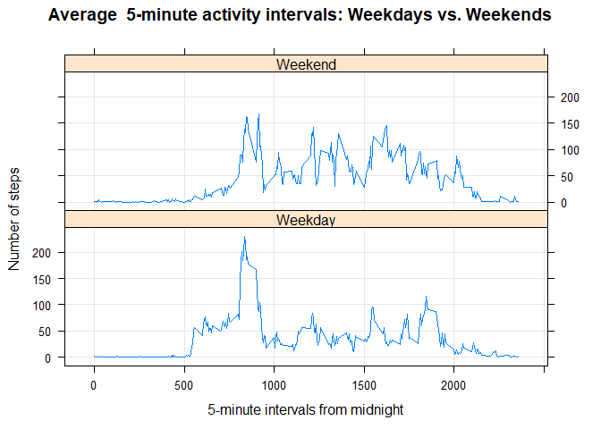

## Introduction
It is now possible to collect a large amount of data about personal movement using activity monitoring devices such as a Fitbit, Nike Fuelband, or Jawbone Up. These type of devices are part of the “quantified self” movement – a group of enthusiasts who take measurements about themselves regularly to improve their health, to find patterns in their behavior, or because they are tech geeks. But these data remain under-utilized both because the raw data are hard to obtain and there is a lack of statistical methods and software for processing and interpreting the data.

This assignment makes use of data from a personal activity monitoring device. This device collects data at 5 minute intervals through out the day. The data consists of two months of data from an anonymous individual collected during the months of October and November, 2012 and include the number of steps taken in 5 minute intervals each day.

## Loading and preprocessing the data
Unzip data to obtain a csv file.


```r
library("impute")
activity <- read.csv("activity.csv", header = T, sep = ",")
# convert date
activity$date <- as.Date(activity$date)
```

## What is mean total number of steps taken per day?

Total steps per day:

```r
actPerDay <- tapply(activity$steps, activity$date, sum, na.rm=T)
head(actPerDay)
```

```
## 2012-10-01 2012-10-02 2012-10-03 2012-10-04 2012-10-05 2012-10-06 
##          0        126      11352      12116      13294      15420
```

Histogram of steps per day:

```r
hist(actPerDay, xlab = "Steps per day (sum)", main = "Histogram of steps per day")
```

<!-- -->

Calculate and report the mean and median of the total number of steps taken per day

```r
mean_su <- round(mean(actPerDay))
median_su <- round(median(actPerDay))

print(c("Mean",   mean_su))
```

```
## [1] "Mean" "9354"
```

```r
print(c("Median", median_su))
```

```
## [1] "Median" "10395"
```


## What is the average daily activity pattern?

Make a time series plot (i.e. \color{red}{\verb|type = "l"|}type="l") of the 5-minute interval (x-axis) and the average number of steps taken, averaged across all days (y-axis)


```r
ival <- tapply(activity$steps, activity$interval, mean, na.rm=T)
plot(ival ~ unique(activity$interval), type="l", xlab = "5 minute interval", ylab = "Steps taken")
```

<!-- -->

Which 5-minute interval, on average across all the days in the dataset, contains the maximum number of steps?


```r
ival[which.max(ival)]
```

```
##      835 
## 206.1698
```

## Imputing missing values

Note that there are a number of days/intervals where there are missing values (coded as \color{red}{\verb|NA|}NA). The presence of missing days may introduce bias into some calculations or summaries of the data.

Calculate and report the total number of missing values in the dataset (i.e. the total number of rows with \color{red}{\verb|NA|}NAs)


```r
table(is.na(activity) == TRUE)
```

```
## 
## FALSE  TRUE 
## 50400  2304
```

Devise a strategy for filling in all of the missing values in the dataset. The strategy does not need to be sophisticated. For example, you could use the mean/median for that day, or the mean for that 5-minute interval, etc.

Create a new dataset that is equal to the original dataset but with the missing data filled in.


```r
# Dataset without NAs (NAs are replaced by means)
activity2 <- activity  # creation of the dataset that will have no more NAs
for (i in 1:nrow(activity)){
    if(is.na(activity$steps[i])){
        activity2$steps[i]<- ival[[as.character(activity[i, "interval"])]]
    }
}
```

Make a histogram of the total number of steps taken each day and What is the impact of imputing missing data on the estimates of the total daily number of steps?


```r
su2 <- tapply(activity2$steps, activity2$date, sum, na.rm=T)
hist(su2, xlab = "sum of steps per day", main = "histogram of steps per day")
```

<!-- -->

Calculate and report the mean and median total number of steps taken per day. Do these values differ from the estimates from the first part of the assignment? 


```r
mean_su2 <- round(mean(su2))
median_su2 <- round(median(su2))
print(c("The mean is",mean_su2))
```

```
## [1] "The mean is" "10766"
```

```r
print(c("The median is",median_su2))
```

```
## [1] "The median is" "10766"
```

Comparing the new and old values

```r
df_summary <- NULL
df_summary <- rbind(df_summary, data.frame(mean = c(mean_su, mean_su2), median = c(median_su, median_su2)))
rownames(df_summary) <- c("with NA", "without NA")
print(df_summary)
```

```
##             mean median
## with NA     9354  10395
## without NA 10766  10766
```

Comparing the two data sets

```r
summary(activity)
```

```
##      steps             date               interval     
##  Min.   :  0.00   Min.   :2012-10-01   Min.   :   0.0  
##  1st Qu.:  0.00   1st Qu.:2012-10-16   1st Qu.: 588.8  
##  Median :  0.00   Median :2012-10-31   Median :1177.5  
##  Mean   : 37.38   Mean   :2012-10-31   Mean   :1177.5  
##  3rd Qu.: 12.00   3rd Qu.:2012-11-15   3rd Qu.:1766.2  
##  Max.   :806.00   Max.   :2012-11-30   Max.   :2355.0  
##  NA's   :2304
```

```r
summary(activity2)
```

```
##      steps             date               interval     
##  Min.   :  0.00   Min.   :2012-10-01   Min.   :   0.0  
##  1st Qu.:  0.00   1st Qu.:2012-10-16   1st Qu.: 588.8  
##  Median :  0.00   Median :2012-10-31   Median :1177.5  
##  Mean   : 37.38   Mean   :2012-10-31   Mean   :1177.5  
##  3rd Qu.: 27.00   3rd Qu.:2012-11-15   3rd Qu.:1766.2  
##  Max.   :806.00   Max.   :2012-11-30   Max.   :2355.0
```


## Are there differences in activity patterns between weekdays and weekends?

Create a new factor variable in the dataset with two levels – “weekday” and “weekend” indicating whether a given date is a weekday or weekend day.


```r
Sys.setenv(LANG = "en")
activity2$weekday = weekdays(activity2$date)

activity2$weekdaytype <- ifelse(activity2$weekday == "Saturday" | activity2$weekday == "szombat" | activity2$weekday == "vasárnap" | activity2$weekday == 
    "Sunday", "Weekend", "Weekday")

activity2$weekdaytype <- factor(activity2$weekdaytype)
table(activity2$day)
```

```
## < table of extent 0 >
```


Make a panel plot containing a time series plot (i.e. \color{red}{\verb|type = "l"|}type="l") of the 5-minute interval (x-axis) and the average number of steps taken, averaged across all weekday days or weekend days (y-axis). See the README file in the GitHub repository to see an example of what this plot should look like using simulated data.


```r
library(lattice)
activity2aggr <- aggregate(steps ~ interval + weekdaytype, data=activity2, FUN="mean")
xyplot(steps ~ interval | weekdaytype, data=activity2aggr, type="l", grid=T, layout=c(1,2), ylab="Number of steps", xlab="5-minute intervals from midnight", main="Average  5-minute activity intervals: Weekdays vs. Weekends")
```

<!-- -->


